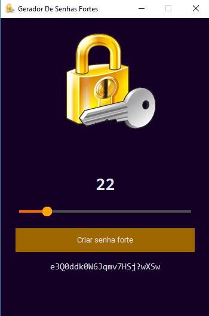

## BIBLIOTECAS QUE DEVEM SER INSTALADAS
- CustomTkinter
- Pillow
- PyperClip

## COMO INSTALAR?

```bash
    pip install customtkinter pillow pyperclip
```

## COMO RODAR O PROGRAMA?

```bash
    py main.py
```

*NOTA: Ao clicar no "criar senha forte", a senha gerada é imediatamente copiada para área de transferência, em seguida é só dar um __ctrl+V__ ou __cmd+V__*